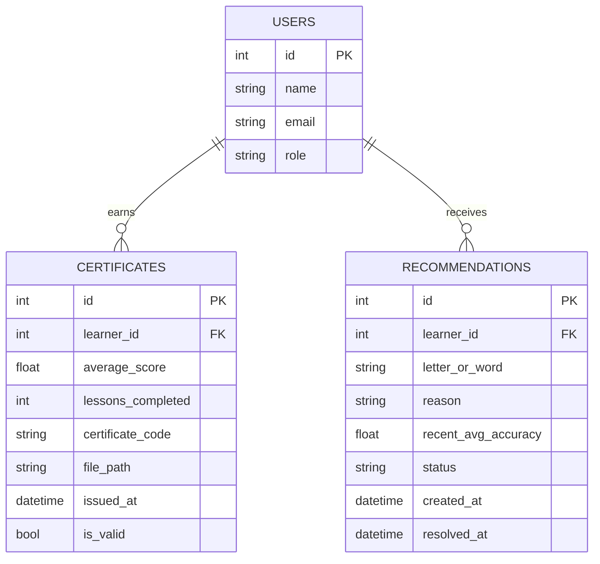

# Milestone 2 — Updated ER Diagram (Day 2)

Renders on GitHub, in VS Code (Markdown Preview Mermaid extension), or at
https://mermaid.live — no paid tool needed, matching the SRS's "free tools
only" rule.

New this Day 2: **certificates** and **recommendations**, both linked to the
existing `users` table from Milestone 1. `instructor_students` and the
`lessons` field updates land later this week (Day 3 and Day 5).

## Notes for the team
- `certificates.learner_id` and `recommendations.learner_id` both `ON DELETE CASCADE`
  into `users.id` — if a user account is removed, their certificates/recommendations
  go with it.
- `certificate_code` is unique and separate from the primary key, so Intern 1's
  Reports page or an external verifier can look a certificate up without
  exposing the internal row id.
- `status` on `recommendations` is a plain string (`active` / `completed` /
  `dismissed`) rather than a DB enum, to keep this portable across
  SQLite (local dev) and Postgres (free cloud tier) without migration pain.
- Coming Day 3: `instructor_students` mapping table.
- Coming Day 3/5: `lessons` gets `category` and `difficulty` columns.
